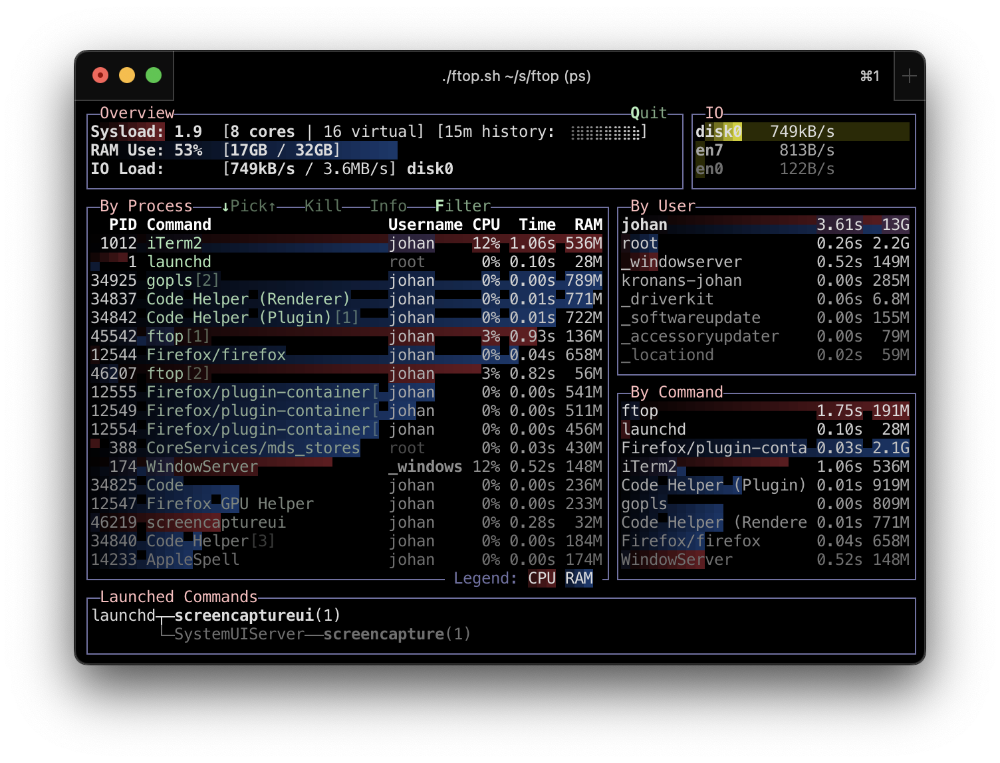
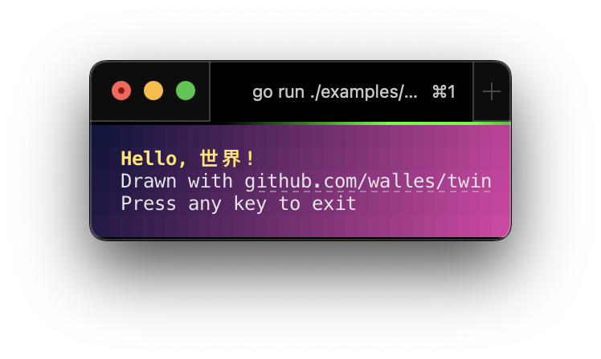

[](https://pkg.go.dev/github.com/walles/twin#section-documentation)
[](https://github.com/walles/twin/actions/workflows/linux-ci.yml)
[](https://github.com/walles/twin/actions/workflows/windows-ci.yml)

Twin is a low-level library for drawing to the terminal screen: you own the
widgets and layout, twin owns the terminal. Originally built for the
[moor](https://github.com/walles/moor) pager, it's been battle-tested across
Linux, macOS and Windows ever since.

# Features

* [Clickable hyperlinks](https://pkg.go.dev/github.com/walles/twin#Style.WithHyperlink)
  in terminals that support them
* [Automatic color downsampling](https://github.com/walles/twin/blob/a19a4ca4960118d8a93f57cd865933a76b41e08c/colors.go#L235-L284),
  so full 24-bit color degrades gracefully on terminals that don't support
  truecolor
* [Self-healing raw mode](https://github.com/walles/twin/blob/a19a4ca4960118d8a93f57cd865933a76b41e08c/screen-setup.go#L18-L51):
  detects when another program resets your terminal settings behind your back
  and restores them
* [Transparent suspend/resume](https://github.com/walles/twin/blob/a19a4ca4960118d8a93f57cd865933a76b41e08c/screen-suspend.go#L12-L32):
  Ctrl-Z drops you to the shell and back cleanly
* [Efficient rendering](https://github.com/walles/twin/blob/a19a4ca4960118d8a93f57cd865933a76b41e08c/screen.go#L1129-L1212)
  that only redraws what changed on screen, not the whole frame every time
* [Wide-character support](https://pkg.go.dev/github.com/walles/twin#StyledRune.Width),
  so CJK and other double-width characters render without corrupting the
  layout
* [Native progress indicators](https://pkg.go.dev/github.com/walles/twin#Screen.SetProgress),
  reporting task progress to the terminal / taskbar, including error and
  indeterminate states
* [Terminal background color detection](https://pkg.go.dev/github.com/walles/twin#Screen.TerminalBackground),
  so your program can adapt to it if needed

# Demo

The [moor](https://github.com/walles/moor) pager was built using twin.

So is [ftop](https://github.com/walles/ftop):



# Installation

```
go get github.com/walles/twin
```

# Usage

Here's [examples/hello](examples/hello), a complete, runnable program. Run it
yourself, after cloning this repo:

```
go run ./examples/hello
```



```go
// Command hello is a minimal, runnable twin demo. It draws some wide-character
// text over a diagonal color gradient, redrawing on resize, then waits for a
// keypress before exiting cleanly.
package main

import (
	"fmt"
	"os"

	"github.com/walles/twin"
)

func main() {
	screen, err := twin.NewScreen(twin.Options{})
	if err != nil {
		fmt.Fprintln(os.Stderr, err)
		os.Exit(1)
	}
	defer screen.Close()

	screen.SetProgress(twin.ProgressStateIndeterminate, 0)

	draw(screen)
	screen.Show()

	for event := range screen.Events() {
		switch event.(type) {
		case twin.EventExit, twin.EventKeyCode, twin.EventRune:
			return

		case twin.EventResize:
			draw(screen)
			screen.Show()
		}
	}
}

// draw renders the whole demo screen: the gradient background plus the
// greeting text on top of it. Called both up front and on every resize.
func draw(screen twin.Screen) {
	titleStyle := twin.StyleDefault.WithForeground(twin.NewColor24Bit(255, 230, 120)).WithAttr(twin.AttrBold)
	bodyStyle := twin.StyleDefault.WithForeground(twin.NewColor24Bit(230, 230, 230))

	url := "https://www.youtube.com/watch?v=dQw4w9WgXcQ"
	linkStyle := bodyStyle.WithHyperlink(&url)

	drawText(screen, 2, 1, "Hello, 世界!", titleStyle)
	column := drawText(screen, 2, 2, "Drawn with ", bodyStyle)
	drawText(screen, column, 2, "github.com/walles/twin", linkStyle)
	drawText(screen, 2, 3, "Press any key to exit", bodyStyle)

	drawGradientBackground(screen)
}

// drawText writes text into screen starting at (column, row), advancing by each
// rune's actual on-screen width so wide characters don't overlap what follows
// them. Returns the column right after the text, for chaining
// differently-styled text on the same line.
func drawText(screen twin.Screen, column int, row int, text string, style twin.Style) int {
	for _, r := range text {
		width := screen.SetCell(column, row, twin.StyledRune{Rune: r, Style: style})
		column += width
	}
	return column
}

// drawGradientBackground paints every cell's background in a diagonal gradient
// from top-left to bottom-right. It runs after the text has already been drawn,
// and reads each cell back with GetCell() so it only changes the background,
// leaving that cell's rune and foreground color untouched.
func drawGradientBackground(screen twin.Screen) {
	topLeft := twin.NewColor24Bit(20, 20, 60)
	bottomRight := twin.NewColor24Bit(200, 70, 160)

	width, height := screen.Size()
	for row := range height {
		for column := range width {
			t := float64(column+row) / float64(width+height-2)

			cell := screen.GetCell(column, row)
			cell.Style = cell.Style.WithBackground(topLeft.Mix(bottomRight, t))
			screen.SetCell(column, row, cell)
		}
	}
}
```

Twin opens an alternate screen buffer that it draws into.

See the full API docs at
[pkg.go.dev/github.com/walles/twin](https://pkg.go.dev/github.com/walles/twin#section-documentation).

# Making a new release

1. `git tag --annotate vX.Y.Z`, note the leading `v` in the version number.
   Write something descriptive in the annotation message.
1. `git push --tags`
